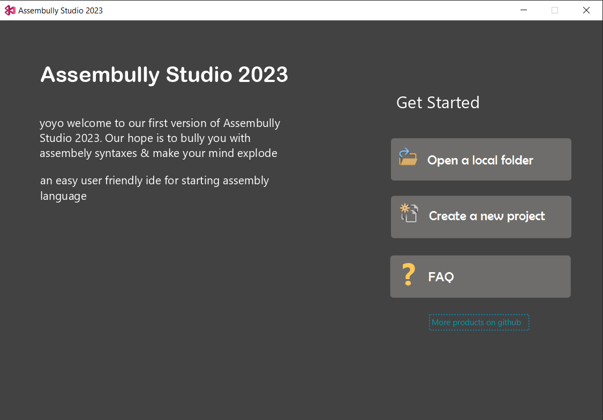
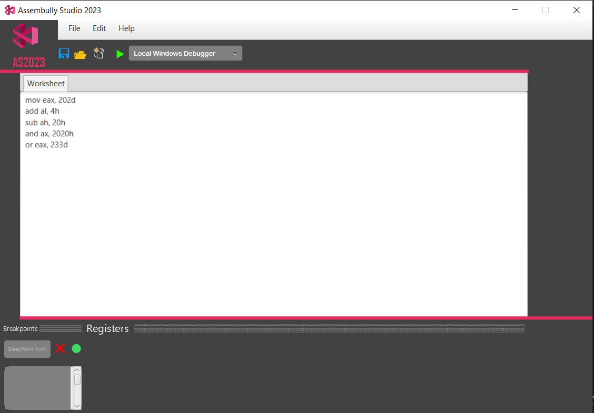

# Assembler with javafx GUI
### a user friendly IDE for assembely language including basic instruction(Mov,Sub,Add ,...) 

more feature:
* jmp instruction
* Debug Mode
* save project
* open project from desired path

### app environment

#### firstMenu

#### codeEnv

### running app
just clone the repo and run the "app.java"

License
=======

    Copyright 2023 Mohammad Sadra Sarparandeh
    Licensed under the Apache License, Version 2.0 (the "License");
    you may not use this file except in compliance with the License.
    You may obtain a copy of the License at

       http://www.apache.org/licenses/LICENSE-2.0

    Unless required by applicable law or agreed to in writing, software
    distributed under the License is distributed on an "AS IS" BASIS,
    WITHOUT WARRANTIES OR CONDITIONS OF ANY KIND, either express or implied.
    See the License for the specific language governing permissions and
    limitations under the License.